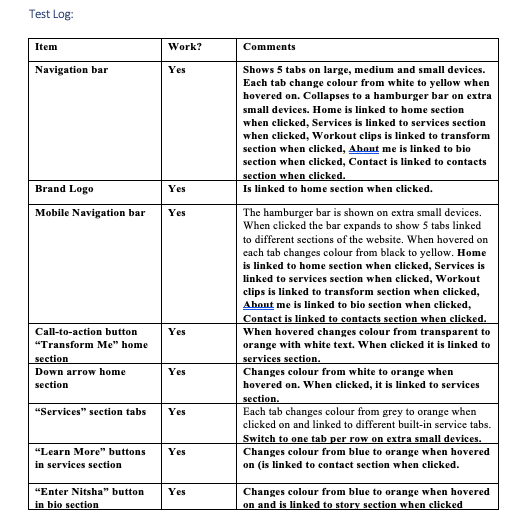
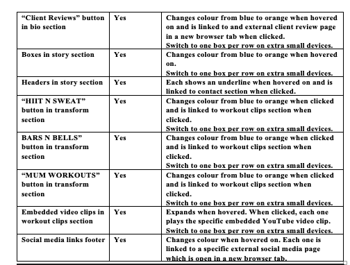

# Your Project's Name

This is a responsive website showcasing my fitness personal training services focusing mainly on female clients. All services are catered to fitness needs of modern women including pre and postnatal rehabilitation, strength training, and weight loss. The website also shows sample workout clips as well as trainer’s brief biography and fitness philosophy. Audience can contact to request further information or click to social media links to see other references.

## UX
 This website is for women who are health conscious and who strive to achieve healthy lifestyle. The colour-theme is clean, fun/vibrant yet feminine. The website has a clean look which is easy on the eye.

Use this section to provide insight into your UX process, focusing on who this website is for, what it is that they want to achieve and how your project is the best way to help them achieve these things.

This is a one-page website. As the user open the website, firstly, section home will appear. The user is shown a short video of the trainer exercising which gives the user immediate understanding of the purpose of the website and what type of exercise method the trainer is specialised in. In this home section, there is also a clear statement emphasizing the focus on female fitness and an action button indicating that the user wants to transform herself physically.

When clicking the action button, the user is then led to the next section showing different services provided, followed by trainer’s bio and client reviews. After that the user is shown additional working videos and then contact details in order to request further information from the trainer. 

## Features
-	Feature 1 “Navigation bar” – shows brand logo and links to different sections of the website.
-	Feature 2 section “Home” – shows short video clip about the website with call to action button and arrow down link.
-	Feature 3 section “Service” – shows different services provided using built-in taps.
-	Feature 4 section “Bio” – show links to personal trainer’s bio and client reviews.
-	Feature 5 section “Story” - shows personal trainer’s bio and work ethos.
-	Feature 6 section “Statement” – shows a short conclusion of what the personal trainer provides.
-	Feature 7 section “Transform” – shows links to different types of workout videos.
-	Feature 8 section “Workout clips” – shows workout videos performed by the personal trainer.
-	Feature 9 section “Contact” – shows contact information and social media links.
-	Feather 10 “Footer” – shows copyright.

### Existing Features
-	Feature 1 “Navigation bar” – is fixed to the top and will always be shown even when user scroll down the page. ON the left corner is the brand logo, when clicked, the user is brought back to the home section of the page. The right side of Nav bar has 5 links. When hovered on each link, the colour is changed to reflect the state. “Home” is linked to home section, “Services” is linked to service section, “Workout clips” is linked to transform section, “About me” is linked to bio section and “Contact” is linked to contact section.

In the future, “Contact” button will be linked to a contact page with a contact form.
-	Feature 2 section “Home” – Has a statement grasping the concept of the website and services provided. The call to action button is descriptive, “Transform Me”, and changes colour when hovered on. When the button is clicked, the user is brought to the service section. The arrow down is also a button, it changes colour when hovered on, and bring user to the next section when clicked. The background shows a short workout video performed by the personal trainer.
-	Feature 3 section “Service” – has built-in taps representing different services. Each tap changes colour when clicked on to show the active state. Inside each tap there is also a call to action button “Learn More”. It changes colour when hovered on and linked to the contact section of the page when clicked.
In the future, “Learn More” button will be linked to a specific service page on the website which gives an in-depth detail of the service with a built-in online chat and contact form.
-	Feature 4 section “Bio” – consists of 2 boxes. The left box has a call to action button “Enter Nitsha”. It changes colour when hovered on and linked to story section when clicked. The right box has a call to action button “Client Review”. It changes colour when clicked on and linked to an external page showing actual past client reviews which will be open in a new browser tap.
-	Feature 5 section “Story” – consists of timeline-like structure. Telling a story from the beginning of what the client experience and needs are and leads on the solutions offered by the personal trainer’s experience and training style. Each box changes colour when hovered on. The boxes have unique icon representing the content of individual box. Each box header shows underline when hovered on and linked to contact section when clicked.

In the future, the header will be linked to contact form and online chat popup.
-	Feature 6 section “Statement” – shows a short conclusion of what the personal trainer provides to reminds the user of the purpose of the website when she first scan through the entire page.
-	Feature 7 section “Transform” – This section has 3 boxes. Each box has call to action button which changes colour when hovered on. Each call the action button is linked to the workout clips section of the website.

In the future, each button will link to a different part of workout clips section showing only the filtered video clips according to the description of the button.
-	Feature 8 section “Workout clips” – shows workout videos performed by the personal trainer. Each box expands when hovered on and linked to individual YouTube video that is embedded to the website.
-	Feature 9 section “Contact” – shows contact information and social media links. Each social media link changes colour when hovered on and linked to external social media page which opens in a new browser tap.

In the future, there will also be a link to a contact page with a contact form.
-	Feather 10 “Footer” – shows copyright.

### Features Left to Implement
- A contact page with a contact form
- Service pages with in-depth service detail and linked to contact form + online chat.
- “Workout clips” section with and function to filter workout video clips.

## Technologies Used
- [JQuery](https://jquery.com)
    - The project uses **JQuery** to simplify DOM manipulation.
- [JQuery ResponsiveTabs] (https://github.com/jellekralt/Responsive-Tabs)
  Responsive Tabs create built-in tabs for the service section.
- [bootstrap]( https://getbootstrap.com/)
To create bootstrap grid layout for the website and general button designs.
- [Fontawesome]( https://fontawesome.com/)
To add well-design icons on the website.

## Testing

Test Log:

## Deployment

This section should describe the process you went through to deploy the project to a hosting platform (e.g. GitHub Pages or Heroku).

In particular, you should provide all details of the differences between the deployed version and the development version, if any, including:
- Different values for environment variables (Heroku Config Vars)?
- Different configuration files?
- Separate git branch?

In addition, if it is not obvious, you should also describe how to run your code locally.

## Credits

### Content
- Content in services and story sections were copied from my own personal training website[http://www.warriormamafit.com/]

### Media

### Acknowledgements

- I received inspiration for this project from X
